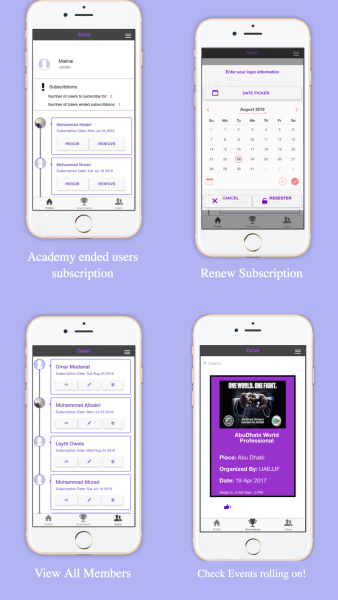
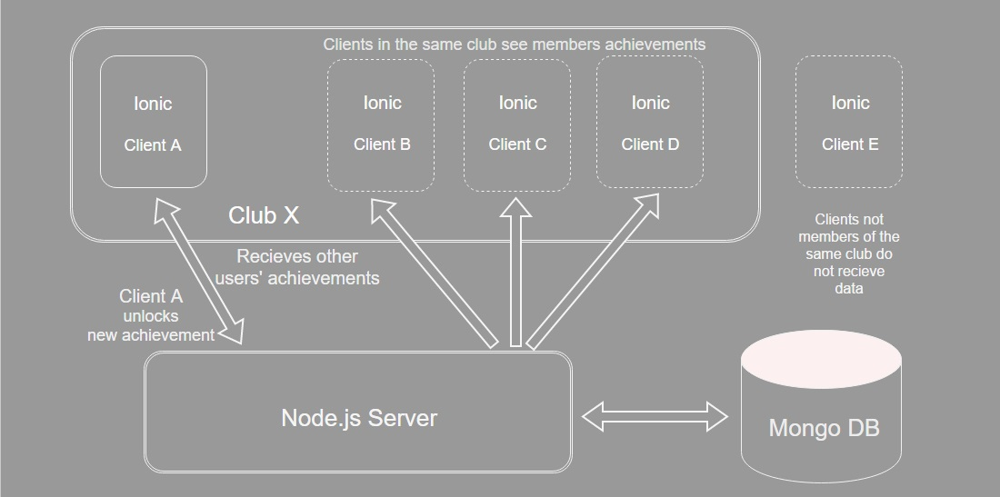

[](https://waffle.io/Sportitsu/Zarad)
[](https://travis-ci.org/Mihyar-30614/Zarad/)


# Zarad 

Zarad is an application that helps JiuJitsu Academies manage their members and facilitate track players achievements plus their history, also it helps each member to see the latest techniques uploaded by the academy.    


## Team

  - __Product Owner__: Mohammad Al-Bakri
  - __Scrum Master__: Mihyar Al-Masalma
  - __Development Team Members__: Fatima Hammami, Elham Rababah, Mohammad Al-Bakri, Mihyar Al-Masalma

## Table of Contents

1. [Usage](#Usage)
1. [ARCHITECTURE](#architecture)
    1. [Tech Stack](#tech-stack)
    1. [System Architecture](#system-architecture)
1. [Requirements](#requirements)
1. [Development](#development)
    1. [Installing Dependencies](#installing-dependencies)
    1. [Tasks](#tasks)
1. [Team](#team)
1. [Contributing](#contributing)

## Usage

<p align="center">
  
  
</p>

> Web Browser application link :
[Click Here](http://zarad.herokuapp.com)

> Preview the app on your phone
```sh
Download Ionic View from Play Store or App store 
Enter this Id : A92B94C3
```


## Running Tests
```sh
npm test
```

## styling guide
```sh
gulp
```

## Architecture

### Tech Stack

1) Front-End
- Ionic  
- Angular

2) Back-End
- Node/Express
- MongoDB


3) Testing
- Mocha
- Chai
- Karma 
- Jasmine

4) Deployment
- Heroku


### System Architecture

<p align="center">
  
</p>

## Requirements

- Node 6.3.x
- mongoDB 4.1.0
- ionic 1.3.1

## Development

### Installing Dependencies

From within the root directory:

```sh
git clone https://github.com/Sportitsu/Zarad.git
```

```sh
npm install -g ionic
npm install
```

```sh
npm install && bower install
```

```sh
Web platform -- > ionic serve
Phone platform -- > ionic serve --lab
```


#APIs Used
- We used the Youtube API to collect Academy youtube channel videos. 
- we used Imgur API to save memory on our database.

#The Database 
Our Database is built using MongoDB, which holds the main three models, Clubs, Members, Tournaments, Admins

# RESTful Routes
| Method        | Endpoint      | Description  |
| ------------- |:-------------:| ------------:|
|Post           |/api/admin/create|create new admin |
|Post|/api/admin/signin|check if the admin authenticat to use the app|
|get|/api/admin/x/:username|get the data of admin depend on username.Username must be passed in as the last part of the URL path|
|post|/api/admin/delete|delete specific admin  |
|Post|/api/admin/admins|get information of all admin|
|get|/api/tournament/x/:name|get information of tournament depend on name.name must be passed in as the last part of the URL path|
|get|/api/tournament/tournaments|get information of all tournaments | 
|post|/api/tournament/create|create new tournaments|
|post|/api/tournament/delete|delete specific tournaments|
|post|/api/tournament/edit'|update tournament information|
|post|/api/tournament/addLike'| add like on tournament|
|post|/api/club/register|create new club|
|get|/api/club/x/:username|get information of club depend on username.username must be passed in as the last part of the URL path|
|get|/api/clubs| get information of all club|
|post|/api/club/delete|Remove specific club |
|post|/api/club/editProfile|update information of club|
|post|/api/club/signin|check if the club authenticat to use the app|
|post|/api/club/getclub|get information of club|
|post|/api/user/delete|delete specific user|
|post|/api/user/editProfile| update information Profile of user|
|get|/api/user/x/:username| get information of user depend on username.username must be passed in as the last part of the URL path|
|get|/api/users| get information of all user|
|post|/api/user/signin| check if the user authenticat to use the app|
|post|/api/user/signup| create new user|
|post|/api/user/resub| check  the user subscribtion to use the app|
|post|/api/user/goals| add goals for specific user|
|get|/api/quotes/get|get information of quote |
|post|/api/quotes/newquote| add new quote to specific user|

### Roadmap

View the project roadmap [here](https://waffle.io/Sportitsu/Zarad)


## Contributing

See [CONTRIBUTING.md](CONTRIBUTING.md) for contribution guidelines.

## Production

See our website [here](http://zarad.herokuapp.com/#/).

## Builds

See our latest build [here](https://travis-ci.org/Sportitsu/Zarad).
